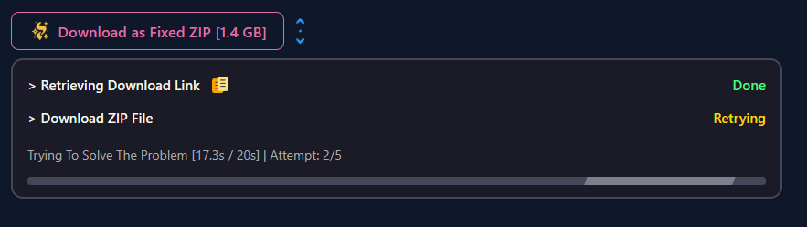

# تعمیرگر فایل‌های زیپ وبتور

🎃 [To change the language to English click here.](README_EN.md)

## این برنامه چکار می‌کنه؟

اگه تا حالا از سایت وبتور فایل دانلود کردی، حتماً با این مشکل مواجه شدی که فایل زیپ‌هاش خراب میان و نمیشه باز کرد. این افزونه کروم همین مشکل رو حل می‌کنه. یعنی فایل خراب رو دانلود می‌کنه، درستش می‌کنه و یه نسخه سالم بهت می‌ده که راحت بتونی استخراج کنی.

## مراحل کار:

### اول: پیدا کردن دکمه دانلود

افزونه خودش دکمه دانلود رو توی سایت وبتور پیدا می‌کنه.

### دوم: دانلود فایل

همون فایل خراب از سایت دانلود میشه.

### سوم: تعمیر و آماده‌سازی

اینجا جادو اتفاق می‌افته! افزونه فایل رو تعمیر می‌کنه و یه نسخه تمیز و سالم درست می‌کنه.

## نصب

### دانلود
۱. فایل‌های پروژه رو دانلود کن
۲. زیپ رو باز کن

### اضافه کردن به کروم
۱. توی کروم برو به `chrome://extensions/`
۲. گزینه "حالت توسعه‌دهنده" رو فعال کن
۳. روی "بارگذاری افزونه فشرده‌نشده" کلیک کن
۴. پوشه افزونه رو انتخاب کن

## کارهای آینده
- [ ] اضافه کردن به فروشگاه مایکروسافت اج
- [ ] اضافه کردن به فروشگاه افزونه‌های کروم

## قابلیت‌ها

✨ تعمیر خودکار فایل‌های خراب
🚀 سریع و راحت
🔧 حفظ ساختار اصلی پوشه‌ها
💯 کار می‌کنه با وبتور

## 🐞 مشکل داری؟
اگه باگ پیدا کردی یا ایده‌ای داری، یه ایشو باز کن.

## مجوز
مجوز MIT - جزئیات رو توی فایل LICENSE ببین. 